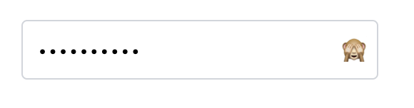
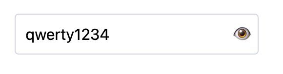
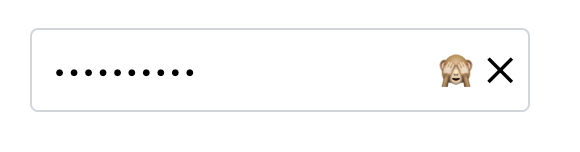
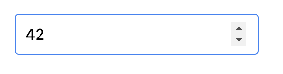
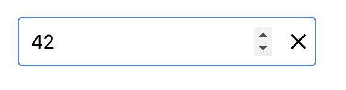
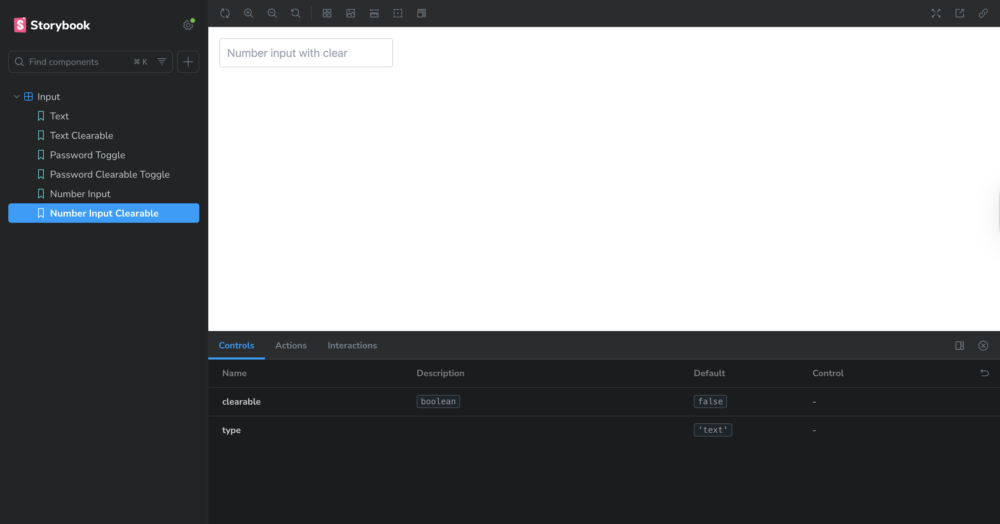

# 🧪 UI Component System — Storybook + React + Tailwind

This project is a UI component system built with React, Vite, Tailwind CSS, and Storybook.  
It includes reusable components for building consistent user interfaces.

---

## ⚙️ Setup Instructions

### 1. Clone the repository

```bash
git clone https://github.com/AnastassiaH/storybook-ui-kit.git
cd storybook-ui-kit
```

### 2. Install dependencies

```bash
npm install
```

### 3. Start Storybook

```bash
npm run storybook
```

Storybook will be available at:

```
http://localhost:6006
```
---

## 🧰 Tech Stack

- React + TypeScript
- Vite
- Tailwind CSS
- Storybook
- ESLint + Prettier

---

## 📥 Input Component

### Features

- Supports input types: `text`, `number`, `password`
- Shows an eye icon to toggle password visibility
- Displays a clear (X) button when `clearable` is true
- Fully typed with TypeScript
- Styled with Tailwind CSS

### Storybook Stories

- Text input
- Password input with visibility toggle
- Number input
- Clearable input examples

---

## 🖼️ Screenshots from Storybook

### Password Input

- Password hidden  
  

- Password visible  
  

- Password clearable  
  

### Number Input

- Number input  
  

- Number clearable  
  

### Text Input

- Text input  
  

- Text clearable  
  

## 🖥️ Storybook UI

